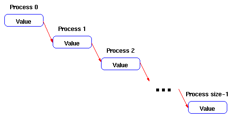
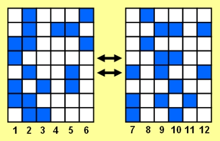
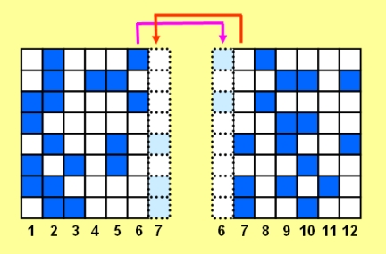

# AQTIVATE Workshop 2023: MPI Lab 2

## Introduction

In this lab you will get more familiar with MPI I/O and MPI performance measurements.

### Goals

- Get experience with MPI collective operations
- Continue to explore MPI performance.

### Duration

1.5 hours

## Exercise 1: Send data across all processes (broadcast)

Write a program that takes data from process zero and sends it to all of the other processes. That is, process i should receive the data and send it to process i+1, until the last process is reached. 

*Figure 1. Broadcast*

Assume that the data consists of a single integer. For simplicity set the value for the first process directly in the code. You may want to use ``MPI_Send`` and ``MPI_Recv`` in your solution.

Implement the same operation using ``MPI Bcast`` and compare performance using ``MPI_Wtime``.

## Exercise 2: Global reductions

Repeat the previous exercise for global reductions.

## Exercise 3: Use P2P communication for the "Game of Life"

In this exercise, you continue learning about point-to-point message-passing routines in MPI.  After completing this exercise, you should be able to write the real parallel MPI code to solve the Game of Life. [Here is some background on the "Game of Life"](Game_of_life.md), in case you are new to the problem.

To start this exercise, add the initialization and finalization routines to the serial "Game of Life" code. This will effectively duplicate the exact same calculation on each processor. In order to show that the code is performing as expected, add statements to print overall size, and the rank of the local process. Don't forget to add the MPI header file.

### Domain Decomposition

In order to truly run the "Game of Life" program in parallel, we must set up our domain decomposition, i.e., divide the domain into chunks and send one chunk to each processor. In the current exercise, we will limit ourselves to two processors. If you are writing your code in C, divide the domain with a horizontal line, so the upper half will be processed on one processor and the lower half on a different processor. If you are using Fortran, divide the domain with a vertical line, so the left half goes to one processor and the right half to another.

Hint: Although this can be done with different kinds of sends and receives, use blocking sends and receives for the current problem. We have chosen the configuration described above because in C arrays, rows are contiguous, and in Fortran columns are contiguous. This approach allows the specification of the initial array location and the number of words in the send and receive routines.

One issue that you need to consider is that of internal domain boundaries. Figure 2 shows the "left-right" domain decomposition described above. Each cell needs information from all adjacent cells to determine its new state. With domain decomposition, some of the required cells no longer are available on the local processor. A common way to tackle this problem is through the use of ghost cells. In the current example, a column of ghost cells is added to the right side of the left domain, and a column is also added to the left side of the right domain (shown in Figure 3). After each time step, the ghost cells are filled by passing the appropriate data from the other processor. You may want to refer to the figure in the [background on the "Game of Life"](Game_of_life.md) to see how to fill the other ghost cells.

*Figure 2. Left-right domain decomposition*

*Figure 2. Ghost cells*

### Your Challenge

Implement the domain decomposition described above, and add message passing to the ghost cells. Don't forget to divide the domain using a horizontal line for C and a vertical line for Fortran. In a subsequent lesson we will examine domain decomposition in the opposite direction.

### Source code

- Game of Life: Serial C and Fortran ([game_of_life-serial.c](game_of_life-serial.c) and [game_of_life-serial.f90](game_of_life-serial.f90)) 

## Acknowledgment

The examples in this lab are provided for educational purposes by [National Center for Supercomputing Applications](http://www.ncsa.illinois.edu/), (in particular their [Cyberinfrastructure Tutor](http://www.citutor.org/)), [Lawrence Livermore National Laboratory](https://computing.llnl.gov/) and [Argonne National Laboratory](http://www.mcs.anl.gov/). Much of the LLNL MPI materials comes from the [Cornell Theory Center](http://www.cac.cornell.edu/).  We would like to thank them for allowing us to develop the material for machines at PDC.  You might find other useful educational materials at these sites.
